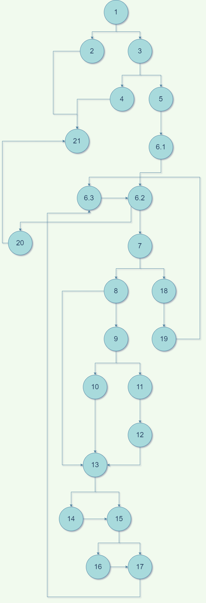

# SI_2022_lab2_206047
Ena Stojmenovska 206047

2. Slika: 
3. Za da se presmeta ciklomatskata kompleksnost kje ja koristam formulata: (broj na rebra)-(broj na jazli)+2=30-23+2=9
4. Every statement kriteriumot se dolzi na testovi koi sto kje gi izminat site jazli vo grafot. Vo ovoj slucaj izminuvanjeto na site jazli moze da se napravi so pomos na 3 testa. Prviot i  vtoriot test se za nevalidno kreiranje listi(List<String> l1 = new ArrayList<>();
   List<String> l2 = Arrays.asList("0","#", "#");). A tretiot slucaj pominuva niz jazlite za realiziranje na programata(List<String> l3 = Arrays.asList("#","0", "#", "0", "0", "#", "0", "#", "0");).
5. Every branch kriteriumot se dolzi na pominuvanje na site rebra preku testovite i istoto moze da se napravi preku prethodno navedenite testovi. Za prvata lista se pominuvaat jazlite: 1, 2 i 21. Za vtorata se 1,3,4 i 21. A za tretata imame 1,3,5,...,21. Rebrata koi se minuvaat vo prviot test se: 1->2, 2->21. Vo vtoriot test se: 1->3, 3->4, 4->21. I za posledniot test se: 1->3, 3->5, i site ostanati nadolu.
6. Ima dve funkcii so testovi. Prvata funkcija ja definira ednakvosta pomegju vlezot i ocekuvaniot izlez kaj lista so koja sto znaeme deka kje zavrsi programata. Vo vtorata funkcija se spravuvame so isklucocite koristejkji gi porakite za da se osigurame deka se tie isklucoci koi se frlaat. 